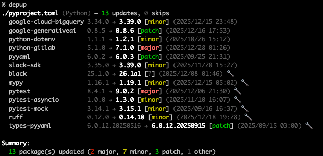
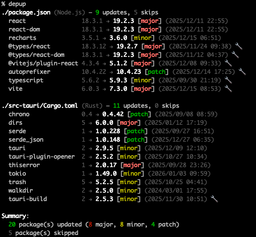
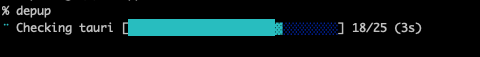

<p align="center">
  
</p>

<h1 align="center">depup</h1>

<p align="center">
  マルチ言語依存関係アップデートCLIツール
</p>

<p align="center">
  <a href="https://github.com/owayo/depup/actions/workflows/ci.yml"></a>
  <a href="https://github.com/owayo/depup/releases"></a>
  <a href="LICENSE"></a>
</p>

<h3 align="center">対応言語</h3>

<p align="center">
  
  
  
  
  
  
  
</p>

<p align="center">
  <a href="README.md">English</a> |
  <a href="README.ja.md">日本語</a>
</p>

---

### 出力例

<table>
  <tr>
    <td align="center">
      <strong>Python (pyproject.toml)</strong><br>
      
    </td>
    <td align="center">
      <strong>Tauri (package.json + Cargo.toml)</strong><br>
      
    </td>
  </tr>
</table>

## 特徴

- **マルチ言語対応**: Node.js, Python, Rust, Go, Ruby, PHP, Java
- **マニフェスト更新**: マニフェストファイル内のバージョン指定を直接更新
- **スマートバージョン処理**: バージョン範囲形式（^, ~, >=）を維持
- **固定バージョン検出**: 意図的に固定されたバージョンはデフォルトでスキップ
- **エイジフィルター**: N日/週前以降にリリースされたバージョンのみに更新
- **pnpm連携**: pnpm設定の `minimumReleaseAge` を自動適用
- **モノレポ対応**: pnpmワークスペースとTauriプロジェクト
- **リリース日表示**: 各バージョンのリリース日時を表示
- **複数出力形式**: テキスト（カラー）、JSON、diff

## 対応言語

| 言語 | マニフェスト | レジストリ | ロックファイル |
|------|-------------|----------|---------------|
|  Node.js | package.json | npm | package-lock.json, pnpm-lock.yaml, yarn.lock |
|  Python | pyproject.toml | PyPI | uv.lock, rye.lock, poetry.lock |
|  Rust | Cargo.toml | crates.io | Cargo.lock |
|  Go | go.mod | Go Proxy | go.sum |
|  Ruby | Gemfile | RubyGems | Gemfile.lock |
|  PHP | composer.json | Packagist | composer.lock |
|  Java | build.gradle, build.gradle.kts | Maven Central | gradle.lockfile |

## 動作要件

- **OS**: macOS, Linux, Windows
- **Rust**: 1.70以上（ソースからビルドする場合）

## インストール

### Homebrew (macOS/Linux)

```bash
brew install owayo/depup/depup
```

### ソースから

```bash
git clone https://github.com/owayo/depup.git
cd depup
cargo install --path .
```

### GitHubリリースから

[GitHubリリース](https://github.com/owayo/depup/releases)から最新のバイナリをダウンロードしてください。

## クイックスタート

```bash
# 全ての依存関係を更新（ドライラン）
depup -n

# Node.jsの依存関係のみ更新
depup --node

# エイジフィルター付きで更新（2週間以上）
depup --age 2w

# diffを表示して更新
depup --diff
```

## 使い方

### 基本構文

```bash
depup [OPTIONS] [PATH]
```

### オプション

| オプション | 短縮形 | 説明 |
|-----------|-------|------|
| `--dry-run` | `-n` | 変更せずに更新内容を表示 |
| `--verbose` | | 詳細出力を有効化 |
| `--quiet` | `-q` | 最小限の出力 |
| `--node` | | Node.jsの依存関係のみ更新 |
| `--python` | | Pythonの依存関係のみ更新 |
| `--rust` | | Rustの依存関係のみ更新 |
| `--go` | | Goの依存関係のみ更新 |
| `--ruby` | | Rubyの依存関係のみ更新 |
| `--php` | | PHPの依存関係のみ更新 |
| `--java` | | Javaの依存関係のみ更新 |
| `--exclude <PKG>` | | 特定パッケージを除外（複数指定可） |
| `--only <PKG>` | | 特定パッケージのみ更新（複数指定可） |
| `--include-pinned` | | 固定バージョンも更新対象に含める |
| `--age <DURATION>` | | 最小リリース経過期間（例: 2w, 10d, 1m） |
| `--json` | | JSON形式で出力 |
| `--diff` | | diff形式で変更を表示 |
| `--install` | | 更新後にパッケージマネージャのinstallを実行 |
| `--version` | `-v` | バージョンを表示 |
| `--help` | `-h` | ヘルプを表示 |

### 使用例

```bash
# 全ての更新をプレビュー
depup -n

# lodashとtypescriptのみ更新
depup --only lodash --only typescript

# reactを更新から除外
depup --exclude react

# 2週間以上経過したパッケージのみ更新
depup --age 2w

# PythonとRustのみ更新
depup --python --rust

# Java（Gradle）の依存関係のみ更新
depup --java

# CI/CD用にJSON出力
depup --json

# 更新後にnpm installを実行
depup --node --install
```

## バージョン処理

### 固定バージョン（デフォルトで除外）

固定バージョンは意図的に固定されているため、デフォルトで更新から除外されます：

| 言語 | 固定の例 | 更新 |
|------|---------|------|
| Node.js | `"1.2.3"` | ❌ |
| Node.js | `"^1.2.3"`, `"~1.2.3"` | ✅ |
| Python | `"==1.2.3"` | ❌ |
| Python | `">=1.2.3"`, `"^1.2.3"` | ✅ |
| Rust | `"=1.2.3"` | ❌ |
| Rust | `"1.2.3"`, `"^1.2.3"` | ✅ |
| Go | `// pinned` コメント | ❌ |
| Ruby | `'= 1.2.3'` | ❌ |
| Ruby | `'~> 1.2.3'`, `'>= 1.2.3'` | ✅ |
| PHP | `"1.2.3"` | ❌ |
| PHP | `"^1.2.3"`, `"~1.2.3"` | ✅ |
| Java | Gradleの固定バージョン | ✅ |

`--include-pinned` で固定バージョンも更新対象にできます。

> **注意**: Goの依存関係は `--include-pinned` フラグに関係なく常に更新対象に含まれます。これは `go.mod` が正確なバージョンのみをサポートし、`^` や `~` のような範囲指定子がないためです。Goのすべてのバージョンは本質的に「固定」されています。

### 範囲形式の維持

depupは元のバージョン範囲形式を維持します：

```
"^1.2.3" → "^2.0.0"  （キャレット維持）
"~1.2.3" → "~1.3.0"  （チルダ維持）
">=1.0.0" → ">=2.0.0" （範囲維持）
```

### 範囲制約（Python）

depupは上限を持つ複合バージョン制約を尊重します：

```
">=3.5.0,<4.0.0"  → そのまま維持、範囲内でのみ更新
```

依存関係に上限制約（例：`<4.0.0`）がある場合、depupは：
- 上限を超えるバージョンを**提案しません**（4.0.0は候補に含まれない）
- マニフェストファイル内の元の制約形式を**維持**します
- より新しい互換バージョンが存在する場合のみ、指定範囲内で**更新**します

## エイジフィルター

`--age` オプションは、一定期間リリースされているバージョンのみに更新することで安定性を確保します：

```bash
# 2週間以上経過したバージョンのみに更新
depup --age 2w

# 10日以上経過したバージョンのみに更新
depup --age 10d

# 1ヶ月以上経過したバージョンのみに更新
depup --age 1m
```

### pnpm連携

depupはpnpm設定から `minimumReleaseAge` を自動的に読み取ります：

**優先順位：**
1. CLI `--age` フラグ（最優先）
2. `.npmrc`（`minimum-release-age=10d`）
3. `pnpm-workspace.yaml`（`minimumReleaseAge: 14400` 分単位）
4. `package.json`（`pnpm.settings.minimumReleaseAge`）

## 出力

### 進捗表示

<p align="center">
  
</p>

### テキスト出力（デフォルト）

- `🔧` はdevDependenciesを示します
- リリース日は `(yyyy/mm/dd HH:MM)` 形式で表示
- 変更種別: `[major]`, `[minor]`, `[patch]`

### JSON出力

```bash
depup --json
```

```json
{
  "manifests": [
    {
      "path": "package.json",
      "language": "node",
      "updates": [
        {
          "type": "update",
          "dependency": {
            "name": "lodash",
            "version_spec": "^4.17.20"
          },
          "new_version": "4.17.21",
          "released_at": "2024-12-15T10:30:00Z"
        }
      ]
    }
  ]
}
```

### Diff出力

```bash
depup --diff
```

```diff
--- package.json
+++ package.json
@@ dependencies @@
-  "lodash": "^4.17.20"
+  "lodash": "^4.17.21"
```

## モノレポ対応

### pnpmワークスペース

depupは `pnpm-workspace.yaml` を検出し、全てのワークスペースパッケージを処理します。

### Tauriプロジェクト

depupはTauriプロジェクトの `src-tauri/Cargo.toml` を自動検出します。

## ビルド

```bash
# デバッグビルド
cargo build

# リリースビルド
cargo build --release

# テスト実行
cargo test

# ローカルインストール
cargo install --path .
```

## コントリビュート

コントリビュートを歓迎します！お気軽にプルリクエストをお送りください。

## ライセンス

[MIT](LICENSE)
