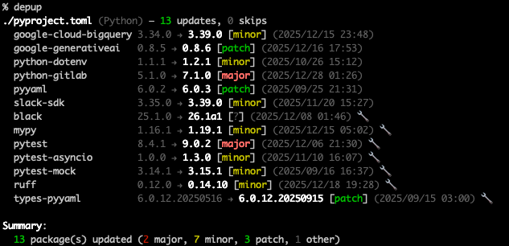
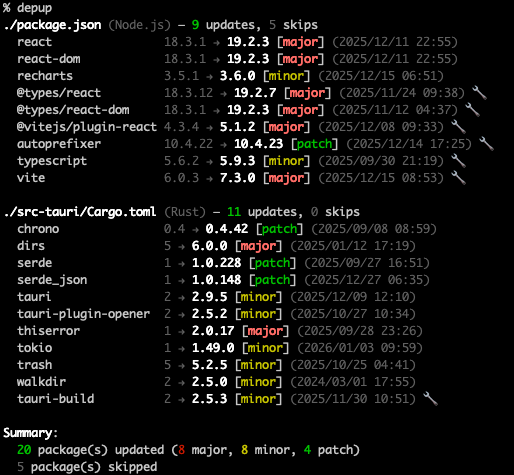
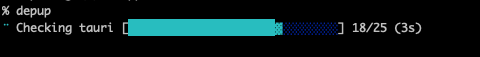

<p align="center">
  
</p>

<h1 align="center">depup</h1>

<p align="center">
  Multi-language dependency updater CLI tool
</p>

<p align="center">
  <a href="https://github.com/owayo/depup/actions/workflows/release.yml"></a>
  <a href="https://github.com/owayo/depup/actions/workflows/ci.yml"></a>
  <a href="https://github.com/owayo/depup/releases"></a>
  <a href="LICENSE"></a>
</p>

<h3 align="center">Supported Languages</h3>

<p align="center">
  
  
  
  
  
  
  
  
</p>

<p align="center">
  <a href="README.md">English</a> |
  <a href="README.ja.md">日本語</a>
</p>

---

### Output Examples

<table>
  <tr>
    <td align="center">
      <strong>Python (pyproject.toml)</strong><br>
      
    </td>
    <td align="center">
      <strong>Tauri (package.json + Cargo.toml)</strong><br>
      
    </td>
  </tr>
</table>

## Features

- **Multi-Language Support**: Node.js, Python, Rust, Go, Ruby, PHP, Java, Swift
- **Manifest Updates**: Directly updates version specifications in manifest files
- **Smart Version Handling**: Preserves version range formats (^, ~, >=) while keeping upper bounds intact
- **Pinned Version Detection**: Skips intentionally pinned versions by default
- **Age Filter**: Only update to versions released N days/weeks ago
- **pnpm Integration**: Respects `minimumReleaseAge` from pnpm settings
- **Monorepo Support**: `.depup`, pnpm workspaces, nested package installs, and Tauri projects
- **Release Date Display**: Shows when each new version was released
- **Multiple Output Formats**: Text (colored), JSON, diff

## Supported Languages

| Language | Manifest | Registry | Lock Files |
|----------|----------|----------|------------|
|  Node.js | package.json | npm | package-lock.json, pnpm-lock.yaml, yarn.lock, bun.lock, bun.lockb |
|  Python | pyproject.toml | PyPI | uv.lock, requirements.lock, poetry.lock |
|  Rust | Cargo.toml | crates.io | Cargo.lock |
|  Go | go.mod | Go Proxy | go.sum |
|  Ruby | Gemfile | RubyGems | Gemfile.lock |
|  PHP | composer.json | Packagist | composer.lock |
|  Java | build.gradle, build.gradle.kts, gradle/*.versions.toml | Maven Central | gradle.lockfile |
|  Swift | Package.swift | GitHub Tags | Package.resolved |

## Requirements

- **OS**: macOS, Linux, Windows
- **Rust**: 1.85+ (for building from source)

## Installation

### Homebrew (macOS/Linux)

```bash
brew install owayo/depup/depup
```

### From Source

```bash
git clone https://github.com/owayo/depup.git
cd depup
cargo install --path .
```

### From GitHub Releases

Download the latest binary from [Releases](https://github.com/owayo/depup/releases).

#### macOS (Apple Silicon)

```bash
curl -L https://github.com/owayo/depup/releases/latest/download/depup-aarch64-apple-darwin.tar.gz | tar xz
sudo mv depup /usr/local/bin/
```

#### macOS (Intel)

```bash
curl -L https://github.com/owayo/depup/releases/latest/download/depup-x86_64-apple-darwin.tar.gz | tar xz
sudo mv depup /usr/local/bin/
```

#### Linux (x86_64)

```bash
curl -L https://github.com/owayo/depup/releases/latest/download/depup-x86_64-unknown-linux-gnu.tar.gz | tar xz
sudo mv depup /usr/local/bin/
```

#### Linux (ARM64)

```bash
curl -L https://github.com/owayo/depup/releases/latest/download/depup-aarch64-unknown-linux-gnu.tar.gz | tar xz
sudo mv depup /usr/local/bin/
```

#### Windows

Download `depup-x86_64-pc-windows-msvc.zip` from [Releases](https://github.com/owayo/depup/releases), extract, and add to PATH.

## Quickstart

```bash
# Update all dependencies (dry run)
depup -n

# Update Node.js dependencies only
depup --node

# Update with age filter (2 weeks minimum)
depup --age 2w

# Update and show diff
depup --diff
```

## Usage

### Basic Syntax

```bash
depup [OPTIONS] [PATH]
```

### Options

| Option | Short | Description |
|--------|-------|-------------|
| `--cd <DIR>` | `-C` | Change to directory before running |
| `--dry-run` | `-n` | Show what would be updated without making changes |
| `--verbose` | | Enable verbose output |
| `--quiet` | `-q` | Minimal output |
| `--node` | | Update only Node.js dependencies |
| `--python` | | Update only Python dependencies |
| `--rust` | | Update only Rust dependencies |
| `--go` | | Update only Go dependencies |
| `--ruby` | | Update only Ruby dependencies |
| `--php` | | Update only PHP dependencies |
| `--java` | | Update only Java dependencies |
| `--swift` | | Update only Swift dependencies |
| `--exclude <PKG>` | | Exclude specific packages (repeatable) |
| `--only <PKG>` | | Update only specific packages (repeatable) |
| `--include-pinned` | | Include pinned versions in update |
| `--age <DURATION>` | | Minimum release age (e.g., 2w, 10d, 1m). Overrides global config |
| `--no-age` | | Disable age filter for this run (overrides global config and default) |
| `--osv` | | Check candidates against the OSV.dev vulnerability database and skip versions with known vulnerabilities |
| `--no-osv` | | Disable OSV vulnerability check for this run (overrides global config) |
| `--max-change <LEVEL>` | | Limit allowed bumps: `patch` (patch only), `minor` (patch + minor), `major` (default — all) |
| `--json` | | Output results in JSON format |
| `--diff` | | Show changes in diff format |
| `--install` | | Run package manager install after update |
| `--version` | `-V` | Show version |
| `--help` | `-h` | Show help |

### Examples

```bash
# Preview all updates
depup -n

# Update only lodash and typescript
depup --only lodash --only typescript

# Exclude react from updates
depup --exclude react

# --only takes precedence if the same package is also excluded
depup --only lodash --exclude lodash

# Update packages at least 2 weeks old
depup --age 2w

# Update Python and Rust only
depup --python --rust

# Update Java (Gradle) dependencies
depup --java

# Update Swift (Package.swift) dependencies
depup --swift

# JSON output for CI/CD
depup --json

# Update and run npm install
depup --node --install

# Run in a different directory
depup --cd ./projects/myapp -n
```

## Version Handling

### Pinned Versions (Excluded by Default)

Pinned versions are intentionally fixed and excluded from updates by default:

| Language | Pinned Example | Updated |
|----------|----------------|---------|
| Node.js | `"1.2.3"` | ❌ |
| Node.js | `"^1.2.3"`, `"~1.2.3"` | ✅ |
| Python | `"==1.2.3"` | ❌ |
| Python | `">=1.2.3"`, `"^1.2.3"` | ✅ |
| Rust | `"=1.2.3"` | ❌ |
| Rust | `"1.2.3"`, `"^1.2.3"` | ✅ |
| Go | `// pinned` comment | ❌ |
| Ruby | `'= 1.2.3'` | ❌ |
| Ruby | `'~> 1.2.3'`, `'>= 1.2.3'` | ✅ |
| PHP | `"1.2.3"` | ❌ |
| PHP | `"^1.2.3"`, `"~1.2.3"` | ✅ |
| Java | Fixed version in Gradle | ❌ |
| Java | Strict version in Gradle (`1.2.3!!`) | ❌ |
| Java | Maven Hard requirement (`[1.0]`) | ❌ |
| Swift | `exact: "1.2.3"` | ❌ |
| Swift | `from: "1.2.3"`, `.upToNextMinor` | ✅ |

Use `--include-pinned` to update pinned versions.

> **Note**: Go dependencies are always included in updates regardless of the `--include-pinned` flag, because `go.mod` only supports exact versions (no range specifiers like `^` or `~`). All Go versions are effectively "pinned" by nature.
>
> **Note**: Gemfile compound and exclusion constraints such as `gem "pg", ">= 0.18", "< 2.0"` and `gem "rack", "!= 2.2.4"` are parsed, but depup does not rewrite them automatically. Replacing only part of those constraints can change their meaning, so depup reports them instead of applying an unsafe edit.
>
> **Note**: Gemfile entries that point to non-registry sources without a version (`git:`, `github:`, `bitbucket:`, `gist:`, `path:`, `source:`) are skipped instead of being converted into RubyGems registry constraints. Inline `group:` / `groups:` options are used to classify development dependencies.
>
> **Note**: Gemfile declarations can use either the common Ruby DSL form (`gem "rack", "~> 3.0"`) or parenthesized method-call form (`gem("rack", "~> 3.0")`). Both forms are parsed and updated while preserving the original call style.
>
> **Note**: Cargo renamed dependencies such as `alias = { package = "actual-crate", version = "1" }` are fetched by the real package name and written back through the manifest key. `--only` and `--exclude` accept either name.
>
> **Note**: When `--only` is present, it takes precedence over `--exclude`. This lets an explicit allow-list entry remain updatable even if the same package also appears in a broader exclude list.
>
> **Note**: Composer platform packages such as `php`, `hhvm`, `ext-*`, `lib-*`, and Composer API packages are skipped.
>
> **Note**: Composer/Packagist accepts 1-4 segment numeric versions per `composer/semver`'s `VersionParser`, so depup parses and updates four-segment versions like `1.2.3.4`, `^1.0.0.0`, `~3.4.5.6`, and `1.0.0.*` while rejecting 5+ segment forms as invalid.

### Range Preservation

depup preserves the original version range format:

```
"^1.2.3" → "^2.0.0"  (caret preserved)
"~1.2.3" → "~1.3.0"  (tilde preserved)
">=1.0.0" → ">=2.0.0" (range preserved)
"requests (>=2.28,<3); python_version < '3.12'" → "requests (>=2.31,<3); python_version < '3.12'" (PEP 508 parentheses and marker preserved)
"coverage [toml] >=7,<8" → "coverage [toml] >=7.6,<8" (PEP 508 extras spacing preserved)
"'paramiko>=3.5.0,<4.0.0,'" → "'paramiko>=3.9.1,<4.0.0,'" (PEP 508 trailing comma preserved)
"'paramiko>=3.5.0,<4.0.0'" → "'paramiko>=3.9.1,<4.0.0'" (TOML literal string quote preserved)
"1.x" → "2.x" (wildcard shape preserved)
"1.x.x" → "2.x.x" (all wildcard positions preserved)
"1.2.*" → "1.3.*" (wildcard shape preserved)
"v1.*" → "v2.*" (leading `v` preserved)
"^1.x" → "^2.x" (npm caret + x-range, operator preserved)
"~1.2.x" → "~2.3.x" (npm tilde + x-range, operator preserved)
"5.3.+" → "5.4.+" (Gradle prefix preserved)
"1.2.3!!" → "2.0.0!!" (Gradle strict preserved)
"[1.0]" → "[2.0]" (Maven Hard requirement preserved)
"[1.2.3.Final]" → "[1.3.0]" (Maven Hard requirement with qualifier)
group = "com.google.guava", name = "guava", version = "32.1.2-jre" → version = "33.4.0-jre" (Gradle Kotlin map notation)
junit = "junit:junit:4.13.2" → "junit:junit:4.13.3" (Gradle version catalog library)
guava = "32.1.2-jre" → "33.4.0-jre" (Gradle version catalog version reference)
prefer("1.7.25") → prefer("1.7.36") (Gradle rich version inside a strict range)
"org.slf4j:slf4j-api:[1.7, 1.8[!!1.7.25" → "org.slf4j:slf4j-api:[1.7, 1.8[!!1.7.36" (Gradle strict range shorthand with prefer)
"group:name:1.0.0:classifier@zip" → "group:name:1.1.0:classifier@zip" (Gradle classifier/extension preserved)
```

Floating selectors such as `"*"`, npm dist-tags like `"latest"`, and Gradle dynamic selectors (`"latest.release"`, `"latest.integration"`, `"latest.milestone"`, and any user-defined `latest.<status>`) are skipped to avoid changing them into exact versions.

Gradle rich version declarations using `strictly`, `require`, `prefer`, and `reject` are parsed in dependency blocks such as `implementation("org.slf4j:slf4j-api") { version { ... } }`. String notation shorthand such as `group:name:[1.7, 1.8[!!1.7.25` is also parsed. When `strictly` or `require` declares a range and `prefer` declares the selected version, depup keeps the range as the upper-bound constraint and updates the `prefer` value. Versions listed with `reject` are excluded from update candidates, including dynamic rejects such as `2.+`.

Gradle version catalogs under `gradle/*.versions.toml` are detected as Java manifests. depup parses `[libraries]` entries written as `alias = "group:name:version"`, `module = "group:name"`, `group` / `name` / `version`, and `version.ref`; referenced `[versions]` entries are updated in place. Rich version tables with `strictly`, `require`, `prefer`, `reject`, and `rejectAll` follow the same candidate rules as Gradle build files. `[plugins]` entries are skipped because Gradle plugin IDs are not Maven Central coordinates.

Python compatible release clauses follow PEP 440: `~=1.2` and `~=1.2.3` are valid, while the invalid single-segment form `~=1` is skipped.

PEP 440 prerelease versions are detected and excluded by default even when written without a separator (e.g. `2.0.0rc1`, `1.0rc1`, `1.0.0a1`), so a stable dependency is never accidentally bumped to a release candidate. Post-releases (`1.0.post1`) compare as newer than the corresponding release, and epochs (`1!2.3`) take precedence in comparison.

### Range Constraints

depup respects upper-bound range constraints (both exclusive and inclusive):

```
">=3.5.0,<4.0.0"   → ">=3.9.1,<4.0.0"
">=1.0,<=2.0"      → ">=2.0,<=2.0"
"4.0.0..<5.0.0"    → "4.99.0..<5.0.0"
"4.0.0...4.9.9"    → "4.9.9...4.9.9"
"1.2.0 - 2.0.0"    → "1.9.3 - 2.0.0" (npm hyphen)
"1.0 - 2.0"        → "2.0.9 - 2.0" (npm/Composer partial upper expands to `<2.1`)
"[1.0,2.0)"        → "[1.9.3,2.0)" (Maven-style)
"[1.0,2.0]"        → "[2.0,2.0]" (Maven-style)
"[1.0,2.0.Final)"  → "[1.9.3,2.0.Final)" (Maven qualifier)
"[1.0,2.0-beta1-SNAPSHOT)" → "[1.9.3,2.0-beta1-SNAPSHOT)" (multi-part Maven qualifier)
"[1.0,2.0["        → "[1.9.3,2.0[" (Maven alt upper bracket)
"<4.0.0"           → skipped (upper-bound only)
">1.0.0"           → skipped (exclusive lower bound)
"]1.0,2.0["        → skipped (exclusive Maven lower bound)
```

For npm/Composer hyphen ranges, a partial right-hand side like `1.0 - 2.0` is interpreted as a wildcard-expanded exclusive upper bound, so `2.0.x` updates remain eligible while `2.1.0` is excluded.

When a dependency has a range with an upper bound (e.g., `>=3.5.0,<4.0.0`, `>=1.0,<=2.0`, `4.0.0...4.9.9`), depup will:
- **Not propose** versions that exceed the upper bound
- Keep inclusive boundaries (`<=`, `...`) eligible
- **Preserve** the original constraint shape in the manifest file
- **Update only the lower-bound side** to the newest compatible version within the range

Constraints that cannot be rewritten safely are skipped instead of being rewritten partially. This includes examples such as npm/Composer OR constraints (`^1 || ^2`), any exclusion constraint containing `!=` (`!=1.2.3`, `>=1.0, !=1.5.0, <2.0`), upper-bound-only constraints (`<4.0.0`, `<=2.0`), strict lower bounds (`>1.0.0`), Maven-style ranges without a lower bound (`(,2.0]`), and Maven ranges with an exclusive lower bound (`]1.0,2.0[`).

For JSON manifests, depup only rewrites dependency sections it parses. In `package.json`, `overrides` is left untouched; in `composer.json`, sections such as `replace`, `provide`, and `conflict` are left untouched.

For TOML manifests, depup preserves both basic strings (`"..."`) and literal strings (`'...'`) when updating supported dependency sections. In `Cargo.toml`, dependency updates are limited to dependency tables such as `[dependencies]`, `[dev-dependencies]`, `[build-dependencies]`, `[workspace.dependencies]`, and target-specific dependency tables; metadata tables are left untouched. Cargo dependencies that specify a non-`crates-io` `registry` are skipped because depup only queries crates.io. Cargo comparison ranges may contain more than two comma-separated requirements, for example `>=1.0, <2.0, >=1.0.100`.

Python PEP 508 version lists may include a trailing comma, such as `>=3.5,<4,`; depup parses and preserves that comma when updating the lower bound. Poetry dependencies with a non-`pypi` `source` are skipped, including PEP 621 dependencies enriched by `tool.poetry.dependencies`, because depup only queries PyPI. Poetry's multiple-constraints array form (`foo = [{version = "<=1.9", python = ">=3.6,<3.8"}, {version = "^2.0", python = ">=3.8"}]`) is also skipped, because depup cannot safely rewrite an individual array element without per-element `requires_python` resolution.

For Gradle string notation, depup preserves classifier and extension suffixes such as `:resources@zip` or `@aar`, and skips dependencies that appear only in `//` line comments or `/* ... */` block comments. Gradle version catalog updates preserve the original TOML string or table shape where the version is declared.

For Swift GitHub dependencies, depup recognizes both `v1.2.3` and `V1.2.3` tag prefixes.
depup also skips `Package.swift` dependencies that appear inside `//` line comments or `/* ... */` block comments.
Per the SPM semver 2.0.0 specification, depup parses and updates dependencies that include prerelease identifiers (`1.0.0-beta.1`) and build metadata (`1.0.0+build.123`), including combined forms (`1.0.0-rc.1+sha.abc`).

For `go.mod`, depup treats block endings with trailing comments such as `) // direct deps` as normal block endings when parsing and updating `require`, `replace`, and `exclude` blocks.
Quoted `go.mod` module paths and versions, such as `require "golang.org/x/text" "v0.14.0"`, are parsed and updated while preserving the quotes.

## Age Filter

The `--age` option ensures stability by only updating to versions that have been released for a certain period. **A 1 week (`1w`) age filter is applied by default** to all runs unless overridden:

```bash
# Default — implicit --age 1w
depup

# Only update to versions at least 2 weeks old
depup --age 2w

# Only update to versions at least 10 days old
depup --age 10d

# Only update to versions at least 1 month old
depup --age 1m

# Disable the age filter for this run
depup --no-age
```

### Global Configuration

depup auto-generates `~/.config/depup/config.toml` on first run with commented defaults. Edit it to change depup's defaults globally:

```toml
# ~/.config/depup/config.toml

# Apply this age filter by default to every depup run.
# Accepts the same format as --age (Nd / Nw / Nm). Omit to use the built-in default (1w).
age = "1w"

# Enable OSV vulnerability check by default (commented out by default).
# osv = false
```

**Priority order (highest first):**
1. `--no-age` (disables age entirely)
2. `--age <DURATION>` CLI flag
3. `~/.config/depup/config.toml` `age` value
4. Built-in default (`1w`)

### Resolution Priority

`minimumReleaseAge` declared in the project is always treated as the **project policy** and takes precedence over any CLI / config age value. The full resolution order is:

1. **Project `minimumReleaseAge`** (highest — see sources below; takes the stricter value when multiple sources disagree)
2. CLI `--age <DURATION>`
3. `--no-age` (only effective if no project policy is set)
4. `~/.config/depup/config.toml` `age` value
5. Built-in default `1w`

When a project policy overrides the CLI value, depup prints a yellow warning so the active source is visible:
```
⚠ --age ignored: project's minimumReleaseAge (14 days from pnpm-workspace.yaml) takes precedence
```

To bypass the project setting, remove or override it in the project file.

### Supported `minimumReleaseAge` Sources

**pnpm** (any of the following — first non-empty value wins):
- `.npmrc` (`minimum-release-age=10d`)
- `pnpm-workspace.yaml` (`minimumReleaseAge: 14400` in minutes)
- `package.json` (`pnpm.settings.minimumReleaseAge`)

**bun** (`bunfig.toml`):
```toml
[install]
minimumReleaseAge = 259200  # seconds (e.g. 3 days)
```

When both pnpm and bun sources exist, depup uses the **stricter** (larger) value.

### Swift and Age Filter

The GitHub Tags API does not return per-tag release timestamps, so Swift packages are exempt from the `--age` filter (they are always eligible for updates regardless of the cutoff).

## Limiting Bumps (`--max-change`)

Use `--max-change <LEVEL>` to cap how aggressive depup is about a bump:

```bash
# Only allow patch bumps (1.0.0 → 1.0.5 OK, 1.0.0 → 1.1.0 NG)
depup --max-change patch

# Allow patch + minor (1.0.0 → 1.5.3 OK, 1.0.0 → 2.0.0 NG)
depup --max-change minor

# Default — allow all bumps including major
depup --max-change major
```

When a newer candidate exists but exceeds the cap, that dependency is skipped with reason `max-change=<LEVEL>` instead of being updated.

### Global Configuration

Set a default cap in `~/.config/depup/config.toml`:

```toml
# Limit every depup run to patch + minor by default
max_change = "minor"
```

**Priority order (highest first):**
1. `--max-change <LEVEL>` CLI flag
2. `~/.config/depup/config.toml` `max_change`
3. Built-in default (no cap)

## Vulnerability Check (OSV.dev)

The `--osv` flag queries the public [OSV.dev](https://osv.dev/) database for each candidate version and skips versions with known vulnerabilities. Combined with the age filter, depup naturally falls back to the next safe, mature version:

```bash
# Check candidates against OSV and skip vulnerable versions
depup --osv

# Disable OSV check for this run (overrides global config)
depup --no-osv
```

- The OSV.dev API is public and **does not require any authentication token**.
- Swift packages are skipped — OSV indexes packages by GitHub repository URL rather than by GitHub Tags–style names, so Swift queries from depup would not match.
- API errors do not block updates; affected versions remain in the candidate list and the failure is reported in `--verbose`.

### Global Configuration

Enable OSV checking by default in the auto-generated `~/.config/depup/config.toml`:

```toml
# ~/.config/depup/config.toml

# Default to skipping vulnerable versions on every run.
osv = true
```

**Priority order (highest first):**
1. `--no-osv` (disables the check)
2. `--osv` CLI flag
3. `~/.config/depup/config.toml` `osv` value
4. Built-in default (`false` — OSV check disabled)

## Output

### Progress Display

<p align="center">
  
</p>

### Text Output (Default)

- `🔧` indicates devDependencies
- Release date shown in `(yyyy/mm/dd HH:MM)` format
- Change type: `[major]`, `[minor]`, `[patch]`

### JSON Output

```bash
depup --json
```

```json
{
  "manifests": [
    {
      "path": "package.json",
      "language": "node",
      "updates": [
        {
          "type": "update",
          "dependency": {
            "name": "lodash",
            "version_spec": "^4.17.20"
          },
          "new_version": "4.17.21",
          "released_at": "2024-12-15T10:30:00Z"
        }
      ]
    }
  ]
}
```

### Diff Output

```bash
depup --diff
```

```diff
--- package.json
+++ package.json
@@ dependencies @@
-  "lodash": "^4.17.20"
+  "lodash": "^4.17.21"
```

## Monorepo Support

### `.depup` Configuration File

For monorepo projects with multiple subdirectories, create a `.depup` file at the project root to list additional directories to process:

```
# .depup
gui       # Frontend app
api       # Backend API
shared    # Shared libraries
```

Run `depup` from the root directory to update dependencies across all listed directories at once. The root directory itself is always scanned in addition to the listed directories. Version lookups are cached, so shared packages are only fetched once.
When `--install` is used, depup runs the package manager in the nearest matching monorepo directory for each updated manifest, so nested apps install in their own directories instead of the repository root.

- `#` starts a comment (line or inline)
- Empty lines are ignored
- Paths are relative to the `.depup` file location
- Non-existent directories are warned and skipped
- The root directory is always included as a scan target

### pnpm Workspaces

depup detects `pnpm-workspace.yaml` and processes all workspace packages.

### Tauri Projects

depup automatically detects `src-tauri/Cargo.toml` in Tauri projects.

#### Tauri Version Synchronization

Tauri projects require the npm `@tauri-apps/api` package and the Rust `tauri` crate to have matching major/minor versions. depup automatically synchronizes these versions to prevent build errors.

```
# Error example (version mismatch)
Found version mismatched Tauri packages:
  tauri (v2.10.1) : @tauri-apps/api (v2.9.1)

# depup automatically synchronizes versions
@tauri-apps/api: 2.9.1 → 2.10.0
tauri: 2.9.0 → 2.10.1
```

Both packages are automatically adjusted to the same major.minor version (e.g., 2.10.x).

## Build

```bash
# Debug build
cargo build

# Release build
cargo build --release

# Run tests
cargo test

# Install locally
cargo install --path .
```

## Contributing

Contributions are welcome! Please feel free to submit a Pull Request.

## License

[MIT](LICENSE)
