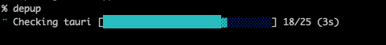

# Command-Line Reference

The syntax, every option, more examples, and the output formats and exit codes of depup. How depup chooses versions is explained in the [Usage Guide](usage.md).

## Basic Syntax

```bash
depup [OPTIONS] [PATH]
```

`PATH` is the directory to process (defaults to the current directory). With `--cd`, depup changes to that directory first and resolves `PATH` from there.

## Options

| Option | Short | Description |
|--------|-------|-------------|
| `--cd <DIR>` | `-C` | Change to directory before running |
| `--dry-run` | `-n` | Show what would be updated without making changes |
| `--verbose` | | Enable verbose output |
| `--quiet` | `-q` | Minimal output |
| `--node` | | Update only Node.js dependencies |
| `--python` | | Update only Python dependencies |
| `--rust` | | Update only Rust dependencies |
| `--go` | | Update only Go dependencies |
| `--ruby` | | Update only Ruby dependencies |
| `--php` | | Update only PHP dependencies |
| `--java` | | Update only Java dependencies |
| `--swift` | | Update only Swift dependencies |
| `--mise` | | Update only mise tool versions (mise.toml / .tool-versions) |
| `--exclude <PKG>` | | Exclude specific packages (repeatable) |
| `--only <PKG>` | | Update only specific packages (repeatable) |
| `--include-pinned` | | Include pinned versions in update |
| `--age <DURATION>` | | Minimum release age (e.g., 2w, 10d, 1m). Overrides global config |
| `--no-age` | | Disable age filter for this run (overrides global config and default, but not a project `minimumReleaseAge`) |
| `--osv` | | Check candidates against the OSV.dev vulnerability database and avoid versions with known vulnerabilities (enabled by default) |
| `--no-osv` | | Disable OSV vulnerability check for this run (overrides global config and default) |
| `--max-change <LEVEL>` | | Limit allowed bumps: `patch` (patch only), `minor` (patch + minor), `major` (default — all) |
| `--json` | | Output results in JSON format |
| `--diff` | | Show changes in diff format |
| `--install` | | Run package manager install after update |
| `--version` | `-V` | Show version |
| `--help` | `-h` | Show help |

When `--only` is present, it takes precedence over `--exclude`. This lets an explicit allow-list entry remain updatable even if the same package also appears in a broader exclude list.

## Examples

```bash
# Preview all updates
depup -n

# Update only lodash and typescript
depup --only lodash --only typescript

# Exclude react from updates
depup --exclude react

# --only takes precedence if the same package is also excluded
depup --only lodash --exclude lodash

# Only update to versions at least 2 weeks old
depup --age 2w

# Update Python and Rust only
depup --python --rust

# Update Java (Gradle) dependencies
depup --java

# Update Swift (Package.swift) dependencies
depup --swift

# Update mise tool versions (mise.toml / .tool-versions)
depup --mise

# JSON output for CI/CD
depup --json

# Update, then run the package manager install (npm install, etc.)
depup --node --install

# Run in a different directory
depup --cd ./projects/myapp -n
```

## Output and Exit Codes

### Progress Display

<p align="center">
  
</p>

### Text Output (Default)

- `🔧` indicates development dependencies (such as devDependencies)
- Known release dates are shown in `(yyyy/mm/dd HH:MM)` format; unavailable dates appear as `(release date unknown)`
- Change type: `[major]`, `[minor]`, `[patch]`
- `✓ OSV` marks versions that passed the vulnerability check. A `↳ OSV skipped:` line below an update lists the vulnerable versions that were removed from the candidates; the dependency itself was still updated
- Skipped dependencies are counted in each manifest heading (`— N updates, M skips`) and in the summary; a manifest with no updates also shows the count per reason
- An update that could not be written to the manifest (for example, a write refused as ambiguous) ends with `✗ failed` and is not counted as an update: the heading becomes `— N updates, K failed, M skips`, and the summary adds `K package(s) failed to update`. The reason is listed in the `Errors:` section
- With `--verbose`, every skipped dependency is listed under its reason, and the summary is broken down by reason and language
- Errors, including OSV notices, are listed in the `Errors:` section

### JSON Output

```bash
depup --json
```

```json
{
  "dry_run": false,
  "summary": {
    "updates": 1,
    "failed": 1,
    "skips": 1
  },
  "manifests": [
    {
      "path": "./package.json",
      "language": "Node.js",
      "updates": [
        {
          "name": "lodash",
          "kind": "registry",
          "from": "4.17.20",
          "to": "4.17.21",
          "dev": false
        }
      ],
      "failed": [
        {
          "name": "react",
          "kind": "registry",
          "from": "18.0.0",
          "to": "19.2.0",
          "dev": false,
          "error": "Refusing to update ambiguous dependency 'react' because it has multiple declarations or a shared version target"
        }
      ]
    }
  ],
  "errors": [
    "Failed to write ./package.json: Refusing to update ambiguous dependency 'react' because it has multiple declarations or a shared version target"
  ]
}
```

`summary.updates` and each manifest's `updates` cover only the updates that were written (with `--dry-run`, the updates that would be written). Updates that could not be written are counted in `summary.failed` and listed in the manifest's `failed` array, with the reason in `error`. Git dependencies use `"kind": "git"` and add `source` (the repository URL with any credentials masked) and `reference`. With `--verbose`, each manifest also lists its `skips`, and the summary adds `by_language`.

### Diff Output

```bash
depup --diff
```

```diff
--- a/./package.json
+++ b/./package.json
@@ lodash @@
-  "lodash": "^4.17.20"
+  "lodash": "^4.17.21"

# 1 package(s) would be updated, 1 failed
```

Updates that could not be written get no hunk. The last line counts updates the same way as the text and JSON output, and adds `, K failed` only when some updates could not be written.

### Exit Codes

| Code | Meaning |
|------|---------|
| `0` | No failures. This includes runs with no updates, dry runs, and runs whose only `Errors:` entries are OSV notices (fallbacks or failed lookups). |
| `1` | A package manager install failed, `--cd` could not change the directory, or depup itself could not continue (for example, the HTTP client failed to initialize or the results could not be written). |
| `2` | Part of the run failed: a manifest could not be read, parsed, or written (including a refused ambiguous write), a registry lookup failed, or a Rust or Node lockfile age audit left violations or unverified entries (including an unreadable lock or an exhausted time budget). Invalid command-line arguments also exit with `2`. |

A code-2 failure does not stop the run. A failed lookup skips that dependency, and a manifest that cannot be read or parsed is left out; everything else is still written and installed. If a file cannot be saved, it keeps its original content. If only some updates in a manifest cannot be written (for example, one refused as ambiguous), the rest are still saved. Either way, the updates that could not be written are reported as failed instead of updated, and they do not make `--install` run. When both `1` and `2` apply, `1` wins.

These lookup problems leave the exit code unchanged:

- A failed `git ls-remote` for a Cargo git dependency (the dependency is skipped)
- A registry that returns no usable versions (`fetch failed: no versions available`)
- A missing `mise` command (mise config files are ignored with a warning)

There is no dedicated code for "updates available"; use `--json` to inspect the result in CI.

Errors are listed in the `Errors:` section of the text output and in the `errors` array of the JSON output. With `--diff`, or with `--quiet` in text output, the list is not printed unless `--verbose` is also given (it then goes to stderr), so check the exit code to detect failures.
